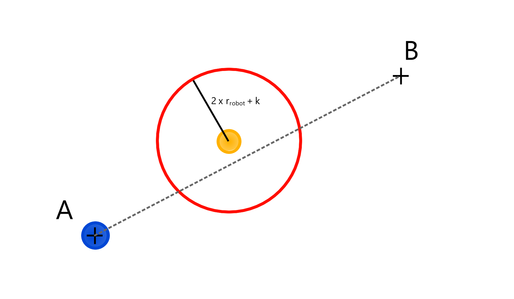
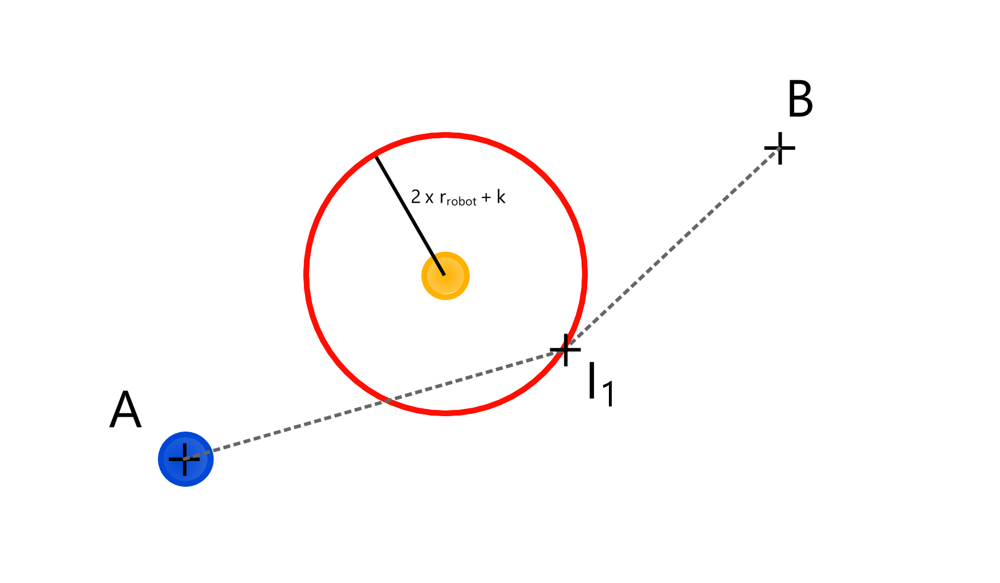

# Strategy #1 - Basic obstacle avoidance with linear trajectories
Writer(s) : Thomas Wanchaï MENIER

## Characteristics

| #          | #        |
|------------|----------|
| Category   | Movement |
| Math level | Basic    |
| Version    | 0.3      |

## Inputs
* Start point : $S$
* Destination point : $D$
* Point to avoid : $A$

## Outputs

1. A array of (x, y) coordinates to attain, to go from  

## Strategy description 

> Robot starts at point A and needs to go to point B.  
> We consider that the optimal path to get to B is a straight line.
> 
> Determine if the optimal path is blocked by enemy robots.  
> If said path is blocked, find a way to get to point B as fast as possible while avoiding 
> the enemy robots in any way you can

## Algorithm description

### Blocking path determination

We only take in account the enemies which are as close or closer to the destination point than we are. 

Consider a "danger circle" around every enemy.  
Danger circle radius is to be determined in a more precise way, but should look like :  

$$r_{danger} = 2 * r_{robot} + k$$

| Parameter         | Description                       | Value                |
|-------------------|-----------------------------------|----------------------|
| $r_{robot}$       | Physical radius of a robot's body | 
TBD
 |
| k                 | #                                 | Constant             |

The constant k should be adjusted to take in account the fact that a given robot might also run towards our new trajectory and disrupt it.
Perhaps it should vary for each enemy robot

Important point : We consider in this draft that, if a robot goes to the edge of a danger circle, it will NOT 
be considered inside this danger circle. This explains the times 2 in the formula, as we consider the radius of our robot,
and the radius of the enemy robot.

If the optimal path cuts at least one danger circle, we will define a new waypoint for the robot to go to, in order to "avoid"
the enemy. Multiple danger circles should create multiple "intermediate" waypoints to go to.

### New waypoint calculation, i.e. how to avoid the enemy
Using the optimal path computed, and the enemy's danger circle,
we need to compute a point that must follow these requirements :
* be a bit closer to the destination point than the enemy
* be on the edge of the danger circle

For simplicity's sake, we will only try in this draft to compute a point on the edge of the circle.  
Here is a drawing to make you understand my idea

*Figure 1 : Optimal path is being blocked because it crosses a danger circle*

*Figure 2 : A new optimal path is computed, with an intermediate waypoint*  

Understand the fact that since we compute a linear trajectory, we won't take into account the fact that the new
intermediate point I1 makes us cross the danger circle. This is just a first version that expects 
that the danger circle is big enough to make the assumption that crossing it isn't too dangerous.  

Once the robot attains the intermediate point I1, the enemy robot in the drawing will not be taken into account
because the blue robot will already be closer to point B.

### Determining intersection between a line and a circle
#### > Line equation used
Fairly simple but seems to work, we only require 2 points that are on the line, and we represent
it under this representation : $y = m*x + p$

m can be easily computed with the following formula

$$m = \frac{y_{b}-y_{a}}{x_{b}-x_{a}}$$

and p using one of the two points that belongs on the line :

$$y_a - m*x_a = p$$

#### > Circle equation used
The current algorithm uses the standard equation form of a circle :

$$(x - k)^2 + (y - h)^2 - r^2$$

where (k, h) are the coordinates of the circle's center, and r is its radius.

#### Solving the equation equality
We use the `scipy.optimize.fsolve` function to solve the following system of equations :  
$$m*x + p - y = 0$$  
$$(x - k)^2 + (y - h)^2 - r^2 = 0$$

The usage of this function isn't quite trivial, I recommend checking out [SciPy's docs](https://docs.scipy.org/doc/scipy/reference/generated/scipy.optimize.fsolve.html)

Becaue of the `full_output` flag set to `True`, we can retrieve the integer telling us whether roots have been found or not. This is how we manage to find the roots. 

## ! Other points to consider !
Enemy robot radius same as ours ?  
k as a variable and not a constant in the danger circle formula ?  
Make better drawings, which don't have flashbang-white backgrounds
